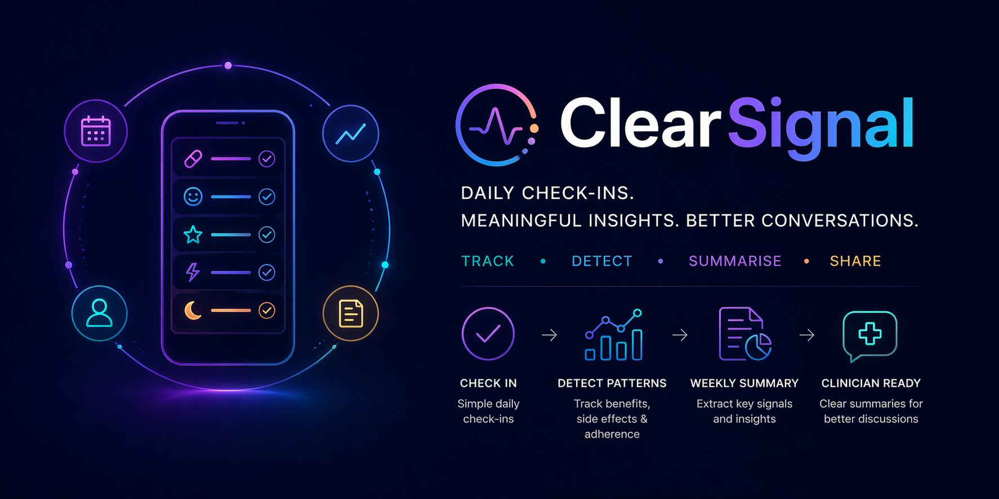

<p align="center">
  
</p>

# ClearSignal

ClearSignal turns simple daily medication check-ins into structured insights and clinician-ready weekly summaries.

Built as a lightweight tool to support medication titration and medication review, it helps surface meaningful patterns from subjective daily data without overwhelming the user.

---

## Why this exists

Medication changes are often guided by vague, inconsistent feedback:

- "It kind of helped"
- "Felt a bit off"
- "Hard to tell"

ClearSignal solves this by:

- Structuring daily check-ins into consistent signals
- Tracking both **benefits** and **side effects**
- Highlighting **patterns across time**
- Producing **clear summaries for discussion with clinicians**

ClearSignal is designed around **treatment context**, not simplistic single-drug attribution.

A treatment context may include one medication or a combination, for example:

- ADHD medication starting while an antidepressant is already established
- ADHD medication plus PRN anxiety medication
- Mood medication changes alongside sleep or anxiety support

The app should help describe what happened under the current treatment plan, not claim that one medication caused a specific effect.

---

## Key features

### Daily check-ins, low friction

A simple, guided flow capturing:

- Medication adherence
- Overall effect
- Primary benefit domain
- Subjective experience
- End-of-day behaviour

---

### Template-driven tracking

ClearSignal uses configurable tracking templates so the same app structure can support different treatment contexts, such as:

- ADHD medication titration
- Mood medication titration
- Combined ADHD + mood/anxiety treatment tracking

Templates define:

- questions
- answer options
- signal types
- issue categories
- optional weights

---

### Weekly summary, signal extraction

Transforms raw check-ins into:

- Days logged / adherence rate
- Most common benefit signal
- Most common issue signal
- Early vs late week pattern
- Interpreted insight
- Actionable guidance

---

### Clinician-ready output

Exportable summary text designed for real conversations:

```text
Data completeness:
- 6 of 7 days logged
- Medication taken on 6 logged days

Effect summary:
- Main benefit signal: Better focus
- Main issue signal: Flat / not myself

Interpretation:
The week shows a consistent pattern of emotional flattening, which is worth monitoring.

Guidance:
There seems to be useful effect around Better focus, but emotional flattening is now the more important discussion point.
```

---

## Current status

ClearSignal currently supports:

- React Native Expo app structure
- local AsyncStorage data persistence
- template selection
- template-scoped check-ins
- value-based answer storage
- label-based UI display
- template-driven signal categories
- weekly summary and copy/share output

---

## Product direction

ClearSignal is evolving from:

> ADHD tracker

to:

> Configurable treatment-response tracking platform

Near-term direction:

- Add a combined ADHD + mood/anxiety tracking template
- Improve wording from "template" toward "tracking plan"
- Keep the current architecture simple while supporting realistic medication combinations

Longer-term possibilities:

- treatment plans composed from reusable modules
- medication-specific adherence questions
- optional Apple Health / wearable context
- AI-assisted diary input converted into structured signals
- PDF export and clinician-facing summaries

---

## Important note

ClearSignal is intended to support, not replace, discussion with a qualified clinician.
